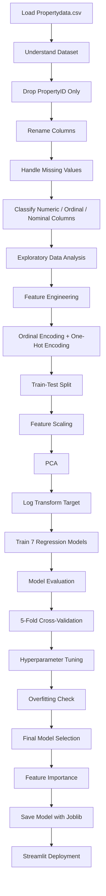

# 🏠 Predicting Property Prices in Ames Using Machine Learning

An end-to-end machine learning capstone project for predicting residential property sale prices in **Ames, Iowa** using property characteristics such as quality, living area, size, age, location, structural features, and amenities.

The project covers the complete workflow from data understanding and preprocessing to model comparison, cross-validation, hyperparameter tuning, model interpretation, and deployment using Streamlit.

---

## 📌 Project Overview

Accurate property valuation is useful for:

- **Buyers** — to assess whether an asking price is reasonable.
- **Sellers** — to estimate a suitable selling price.
- **Real-estate professionals** — to support data-driven property valuation.

The target variable is **`PropPrice` / `Property Price`**, representing the property's sale price in USD.

### Dataset Summary

- **Location:** Ames, Iowa
- **Residential sales:** 1,460
- **Raw dataset shape:** 1,460 × 81
- **PropertyID:** removed as required by the project brief
- **Final encoded matrix:** 1,460 × 238
- **Predictor features:** 237
- **Target:** Property Price

The project brief expected an **R² between 75% and 85%**, with performance above 85% considered much better.

---

## 🎯 Project Objectives

1. Clean and prepare real-estate data.
2. Handle **ordinal and nominal variables separately**.
3. Treat missing values using appropriate `fillna()` strategies.
4. Perform **Exploratory Data Analysis (EDA)** to identify important price drivers.
5. Apply suitable encoding techniques to categorical variables.
6. Use feature scaling and PCA where appropriate.
7. Train and compare multiple machine learning regression models.
8. Evaluate model performance using **MAE, RMSE, and R²**.
9. Improve the strongest model through cross-validation and hyperparameter tuning.
10. Interpret the final model and deploy it using Streamlit.

---

## 🔄 Machine Learning Workflow



---

## 🧹 Data Preprocessing

### Missing Values

Missing values were handled according to their meaning:

- Structural/amenity absence → `"None"`
- Numerical absence → `0`
- `Lot Frontage` → median
- `Electrical System` → mode

The project keeps useful high-missing columns instead of dropping them because, for example, **no pool or no alley is meaningful property information**.

### Categorical Encoding

Two separate strategies were used:

- **Ordinal Encoding** for categories with a meaningful order, such as quality ratings.
- **One-Hot Encoding** for nominal variables such as neighborhood, zoning, roof type, and sale condition.

Quality levels such as:

```text
Po < Fa < TA < Gd < Ex
```

were converted into ordered numerical values.

---

## 🛠 Feature Engineering

New property-level features were created to improve predictive power.

Examples include:

- `HouseAge`
- `RemodAge`
- `IsRemodeled`
- `TotalSF`
- `TotalPorchSF`
- `TotalBathrooms`
- `LivingAreaPerRoom`
- `HasBasement`
- `HasGarage`
- `HasFireplace`
- `HasPool`
- `Has2ndFloor`
- `HasPorch`
- `HasMasonry`
- `QualLivArea`
- `QualCond`
- `GarageScore`
- `SaleMonSin`
- `SaleMonCos`

A particularly important engineered feature was:

```text
QualLivArea = Overall Quality × Above Ground Living Area
```

---

## 📏 Feature Scaling and PCA

Two scaling approaches were explored:

- **StandardScaler**
- **MinMaxScaler**

PCA was fitted on standardized training data.

### PCA Result

- Original predictor features: **237**
- Components retained for approximately 95% variance: **143**
- Variance retained: approximately **95%**

PCA was evaluated mainly with a linear model rather than replacing the original feature space for all models.

---

## 📉 Target Transformation

The property price distribution was right-skewed, so the model target was transformed using:

```python
y_train_log = np.log1p(y_train)
```

Predictions were converted back to the original USD scale using:

```python
predicted_price = np.expm1(pred_log)
```

This keeps final MAE and RMSE directly interpretable in dollars.

---

## 🤖 Models Evaluated

Seven regression approaches were compared:

1. Linear Regression
2. Ridge Regression
3. Lasso Regression
4. Decision Tree
5. Random Forest
6. Gradient Boosting
7. Ridge Regression + PCA

### Initial Holdout Performance

| Model | MAE (USD) | RMSE (USD) | R² |
|---|---:|---:|---:|
| Linear Regression | $16,112 | $25,597 | 0.9146 |
| Ridge Regression | $16,148 | $25,877 | 0.9127 |
| Lasso Regression | $15,715 | $25,894 | 0.9126 |
| Ridge + PCA | $16,955 | $26,853 | 0.9060 |
| Gradient Boosting | $16,850 | $29,477 | 0.8867 |
| Random Forest | $17,366 | $31,379 | 0.8716 |
| Decision Tree | $24,324 | $38,784 | 0.8039 |

Although Linear Regression produced the highest R² on the single holdout split, cross-validation was used to check model stability.

---

## ✅ Cross-Validation

A **5-fold cross-validation** comparison was performed on the training data.

| Model | Mean CV R² | CV Std |
|---|---:|---:|
| Gradient Boosting | **0.8950** | **0.0188** |
| Random Forest | 0.8708 | 0.0211 |
| Lasso Regression | 0.8610 | 0.0522 |
| Ridge Regression | 0.8395 | 0.0416 |
| Linear Regression | 0.8119 | 0.0785 |
| Decision Tree | 0.7218 | 0.0351 |
| Ridge + PCA | 0.4587 | 0.3762 |

**Gradient Boosting** provided the strongest and most stable cross-validation performance and was therefore selected for hyperparameter tuning.

---

## ⚙️ Hyperparameter Tuning

`RandomizedSearchCV` with 5-fold cross-validation was used to tune Gradient Boosting.

### Best Parameters

```python
{
    "subsample": 0.9,
    "n_estimators": 300,
    "min_samples_split": 5,
    "min_samples_leaf": 4,
    "max_depth": 3,
    "learning_rate": 0.08
}
```

Best tuning cross-validation R²:

```text
0.8997
```

---

## 🏆 Final Model

### Tuned Gradient Boosting Regressor

| Metric | Result |
|---|---:|
| **Test R²** | **0.9054 (90.54%)** |
| **MAE** | **$15,223** |
| **RMSE** | **$26,931** |
| **Median Absolute Error** | **$8,993** |

The final model exceeded the project's expected R² range of 75–85%.

### Prediction Accuracy

| Error Range | Test Properties |
|---|---:|
| Within ±5% of actual price | 47.6% |
| Within ±10% | 73.3% |
| Within ±15% | 84.2% |
| Within ±20% | 90.8% |

---

## 🔍 Overfitting Check

The tuned Gradient Boosting model produced:

- **Training R²:** 98.47%
- **Test R²:** 90.54%
- **Train-Test gap:** 7.93 percentage points

A more regularized Gradient Boosting model was also tested, but it reduced test performance and did not improve the train-test gap. Therefore, the original tuned model was retained.

---

## 📊 Feature Importance

The final Gradient Boosting model uses **237 encoded/engineered predictor features**.

The top 15 features account for approximately **88.45%** of total model importance.

### Most Important Price Drivers

| Rank | Feature | Importance |
|---:|---|---:|
| 1 | QualLivArea | 0.4648 |
| 2 | TotalSF | 0.1203 |
| 3 | Overall Quality | 0.0724 |
| 4 | TotalBathrooms | 0.0360 |
| 5 | QualCond | 0.0304 |
| 6 | Kitchen Quality | 0.0248 |
| 7 | GarageScore | 0.0237 |
| 8 | Basement Square Footage | 0.0215 |
| 9 | Year Built | 0.0191 |
| 10 | Property Size | 0.0159 |

### Key Insight

The strongest signal is the interaction between **property quality and usable living area**. Total square footage, overall quality, bathrooms, kitchen quality, garage characteristics, basement area, and property age also contribute meaningfully to valuation.

---

## 💼 Business Interpretation

The model can support:

- **Buyers** in checking whether an asking price appears reasonable.
- **Sellers** in estimating a suitable listing/selling price.
- **Agents and real-estate professionals** in adding a data-driven estimate to traditional valuation.

The analysis indicates that property valuation should consider a combination of **quality, usable living space, total area, age, structural characteristics, location, and amenities**, rather than relying on property size alone.

---

## 🚀 Streamlit Deployment

The final Tuned Gradient Boosting model was saved using `joblib` and deployed as an interactive Streamlit application.

### Live App

**[Open the Property Price Predictor](https://capstone-house-propertyprice.streamlit.app/)**

The app allows users to enter property characteristics and receive an estimated sale price from the trained model.

---

## 🧰 Technologies Used

- Python
- Jupyter Notebook
- Pandas
- NumPy
- Matplotlib
- Seaborn
- Scikit-learn
- Joblib
- Streamlit
- Git / GitHub

---

## 📂 Suggested Repository Structure

```text
capstone-project/
│
├── projectcapstone.ipynb
├── Propertydata.csv
├── app.py
├── requirements.txt
├── tuned_gradient_boosting_model.pkl
├── model_features.pkl
└── README.md
```

> Tip: Rename the notebook to `projectcapstone.ipynb` before uploading to GitHub for a cleaner repository.

---

## ▶️ How to Run the Notebook

Clone or download the repository and install the required packages:

```bash
pip install pandas numpy matplotlib seaborn scikit-learn joblib jupyter
```

Start Jupyter Notebook:

```bash
jupyter notebook
```

Open:

```text
projectcapstone.ipynb
```

Make sure `Propertydata.csv` is available in the same working directory.

---

## 🌐 How to Run the Streamlit App Locally

Install the dependencies:

```bash
pip install -r requirements.txt
```

Run:

```bash
streamlit run app.py
```

---

## 📈 Evaluation Metrics

The project uses:

- **MAE (Mean Absolute Error)** — average absolute prediction error in USD.
- **RMSE (Root Mean Squared Error)** — penalizes larger prediction errors more strongly.
- **R² (Coefficient of Determination)** — proportion of property-price variation explained by the model.

---

## 🎓 Learning Outcomes

This project demonstrates:

- End-to-end regression workflow design
- Real-estate EDA and visualization
- Missing-value treatment
- Ordinal vs nominal encoding
- Domain-based feature engineering
- Scaling and PCA
- Log transformation of a skewed target
- Regression model comparison
- Cross-validation
- Hyperparameter tuning
- Overfitting analysis
- Feature importance and model interpretation
- Model persistence using Joblib
- Streamlit deployment

---

## 📝 Conclusion

The project successfully developed an accurate and interpretable machine learning solution for property-price prediction.

The final **Tuned Gradient Boosting Regressor achieved a Test R² of 90.54%**, outperforming the expected project benchmark. The model also identified meaningful property-price drivers, particularly the combined effect of **overall quality and living area**.

Overall, the project demonstrates how data cleaning, EDA, feature engineering, model comparison, validation, tuning, and interpretability can be combined into a practical property valuation workflow for buyers, sellers, and real-estate professionals.

---

## 📚 Reference

The project is based on the supplied **Capstone Project 1 — Predicting Property Prices in a Specific Location Using Machine Learning** problem statement and the Ames Housing-style property dataset used in the notebook.
